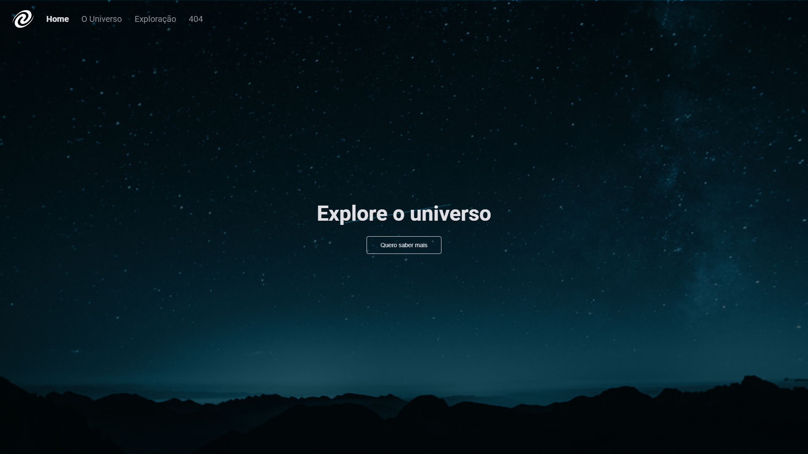

<h1 align="center"> SPA - Universe </h1>

O SPA Universe foi uma aplicação proposta pela RocketSeat no programa de formação WEB EXPLORER e desenvolvida por mim, Juliano Mariano.  

  <a href="#-tecnologias">Tecnologias</a>&nbsp;&nbsp;&nbsp;|&nbsp;&nbsp;&nbsp;
  <a href="#-projeto">Projeto</a>&nbsp;&nbsp;&nbsp;|&nbsp;&nbsp;&nbsp;
  <a href="#-layout">Layout</a>&nbsp;&nbsp;&nbsp;|&nbsp;&nbsp;&nbsp;
  <a href="#-Contato">Contato</a>

 

  

## 🚀 Tecnologias

Esse projeto foi desenvolvido com as seguintes tecnologias:

- HTML e CSS;
- Javascript;
- Git e Github;
- json;
- Node Modules;
- Vercel;
- Figma.

## 💻 Projeto
O objetivo de uma Single Page Application (SPA), ou Aplicação de Página Única, é proporcionar uma experiência de usuário mais fluida e dinâmica, sem a necessidade de recarregar a página inteira a cada interação. Isso é, alcançado e carregando a maior parte do conteúdo da aplicação na primeira carga da página e em seguida, atualizando apenas as partes necessárias conforme interação do usuário.
- [Visite o projeto online](https://julianomariano.github.io/SPA-Universe/)

## 🔖 Layout

Você pode visualizar o layout do projeto através [DESSE LINK](https://www.figma.com/file/iQp1I2BpquRXNPmAI1IzBA/%5BDesafios-Explorer%5D-SPA-Universe-(Copy)?node-id=0%3A1&mode=dev). É necessário ter conta no [Figma](https://figma.com) para acessá-lo.

## 🌐 Contato

LinkedIn: Juliano Mariano
 -  https://www.linkedin.com/in/juliano-marianodev/